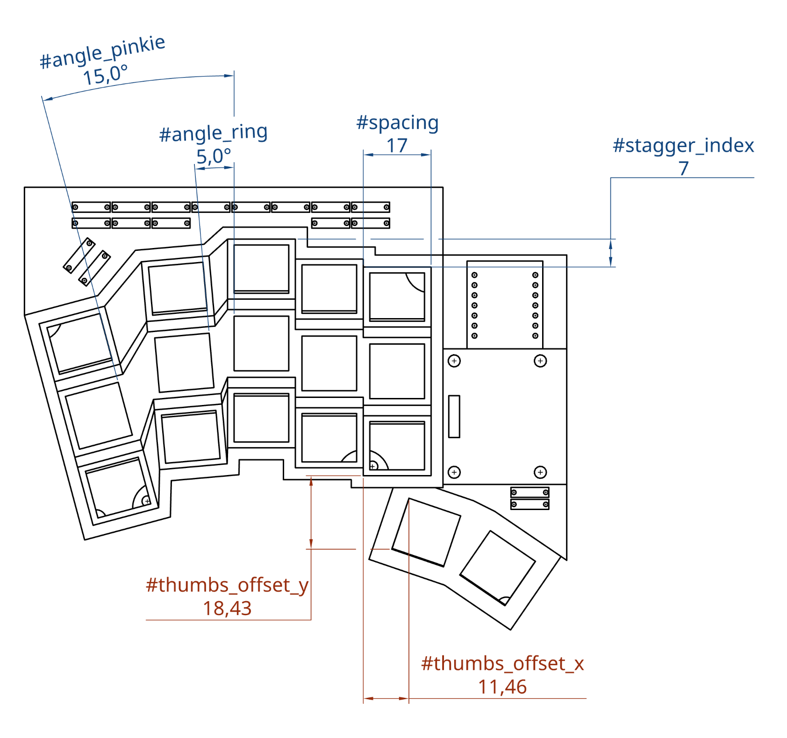

# rkbrd3

Low-profile, 34-key, splayed, concave, split, wireless, fully customizable keyboard optimized for wire wrapping (perfectly fine for "classic" handwiring too).

## Introduction

Every hand is unique. The simple implication is that no keyboard fits all hands perfectly. A keyboard should either be mechanically customizable (see Slavboard) or tailored specifically to an individual's hand. With this keyboard, I'm sharing not only STL files for a ready-to-print version, but also a CAD model that can be customized via various parameters to achieve the most comfortable layout for your hand.

For instance, I have relatively small fingers, so I use a tight key spacing (17 mm). Others may find different spacing, concavity, and splay settings more comfortable.

## Modeling

Here is the link to the model: [OnShape CAD Model](https://cad.onshape.com/documents/c1f04e62418ea8430405ee0e/w/7ba627513a87dc41f966e769/e/bb377df9cee8dd07dce626be). To customize the model, you'll need an OnShape account (free for personal, non-commercial use). You can adjust variable values via the Features view or the Variables table.

I recommend printing the initial model as soon as possible, placing your hand on it in a relaxed position, and adjusting the variables based on your observations.

I've done my best to ensure the model works with a wide range of realistic variable values, but CAD systems like OnShape have their quirks. If the model breaks with your parameters, please let me know.

## 3D Printing

Printing is straightforward. The model generates two parts: the case and the bottom cover. I printed it on a Bambu Lab X1C using PLA-CF with the Standard 0.2 mm profile and slim tree supports enabled. It takes about 2.5 hours to print one case. Use your slicer's mirror tool to produce the right-hand half. You might need to adjust the diode hole size depending on your printer and material.

Please share your printer and settings if they work well for you.

## BOM (Bill of Materials)

| Quantity | Component        | Notes                                                                                                                                                                        |
| -------- | ---------------- | ---------------------------------------------------------------------------------------------------------------------------------------------------------------------------- |
| 2x       | MCU              | [Seeed XIAO BLE nRF52840](https://www.seeedstudio.com/Seeed-XIAO-BLE-nRF52840-p-5201.html)                                                                                   |
| 34x      | Diodes           | Almost any type will work (avoid LEDs!). I use DO-41 package diodes.                                                                                                         |
| 10x      | M2 heat inserts  | 2 mm length                                                                                                                                                                  |
| 10x      | M2 screws        | 3-4 mm flat head                                                                                                                                                             |
| 10x      | Rubber feet      | 5 mm diameter round type                                                                                                                                                     |
| 34x      | Choc V1 switches | The model can be easily modified for other low-profile switch types                                                                                                          |
| 34x      | Keycaps          | I love [LPX keycaps](https://github.com/levpopov/LPX/)                                                                                                                       |
| —        | Wire             | —                                                                                                                                                                            |
| 2x       | CR2032 batteries | —                                                                                                                                                                            |
| 2x       | Battery holders  | Non-standard part, I found it on local amazon: [Amazon link](https://www.amazon.de/dp/B08GX5W8DX). Model adapted for this one. Please let me know if you know better options |
| 8x       | M3 screws        | 8 mm                                                                                                                                                                         |
| 8x       | M3 nuts          | —                                                                                                                                                                            |

## Build Guide

Solder the pins to the MCU and the battery holder. Before wiring, check that your MCU is working properly.

Insert the heat inserts into their designated positions and install them using a soldering iron.

Place the battery holder in its slot and secure it with four M3 screws.

Install the MCU. It may require some force to push the pins through the holes. Strip diode legs to about 4 mm long.

Wire it! :)

After you’ve finished and verified the wiring, bend some of the MCU and diode pins to allow the bottom cover to fit.

Install the bottom cover using small M2 flat-head screws.

Attach rubber feet.

## Wiring

I personally use wire wrapping. It's an affordable, easy-to-learn, and somewhat forgotten method for wiring circuits. You can watch videos like [this one](https://www.youtube.com/watch?v=IXvEDM-m9CE) to learn more.

It’s strong enough for keyboards (time will tell!), easy to correct mistakes, and allows switch changes without mess (no solder residue on pins!). You can always reinforce the wiring later by soldering.

That said, there’s nothing unique about this keyboard's wiring method — classic handwiring works just as well.

With wire wrapping or handwiring, you have complete freedom in designing the keyboard matrice. It’s a good idea to make your wiring compatible with other XIAO-based 34-key keyboard schematics, such as this one: [Forager schematic](https://github.com/carrefinho/forager/blob/main/forager-pcb/forager-pcb.kicad_sch).

I do not provide a specific wiring diagram. If you understand how keyboard matrices work, you’ll know what to do. If not, I highly recommend reading up on the topic — it only takes a few minutes and will greatly help with building and debugging your keyboard. Here's a helpful article: [How Key Matrices Work](https://pcbheaven.com/wikipages/How_Key_Matrices_Works/).

## Firmware

If your wiring is compatible with an existing keyboard schematic, you can use that keyboard’s firmware. For example: [Forager ZMK module](https://github.com/carrefinho/forager-zmk-module).

My personal configuration is here: [rkbrd3 ZMK config](https://github.com/prepor/zmk-config-rkbrd3).
